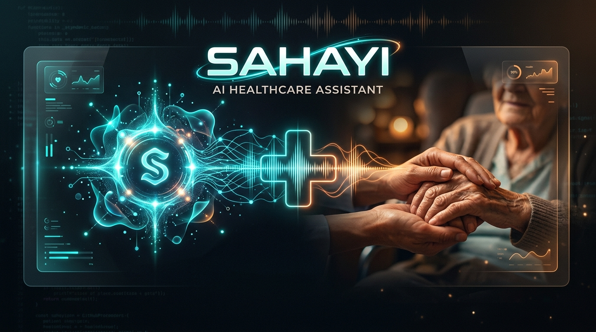
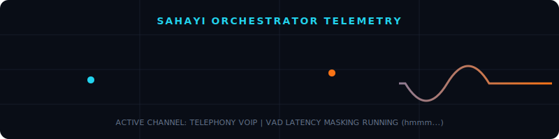
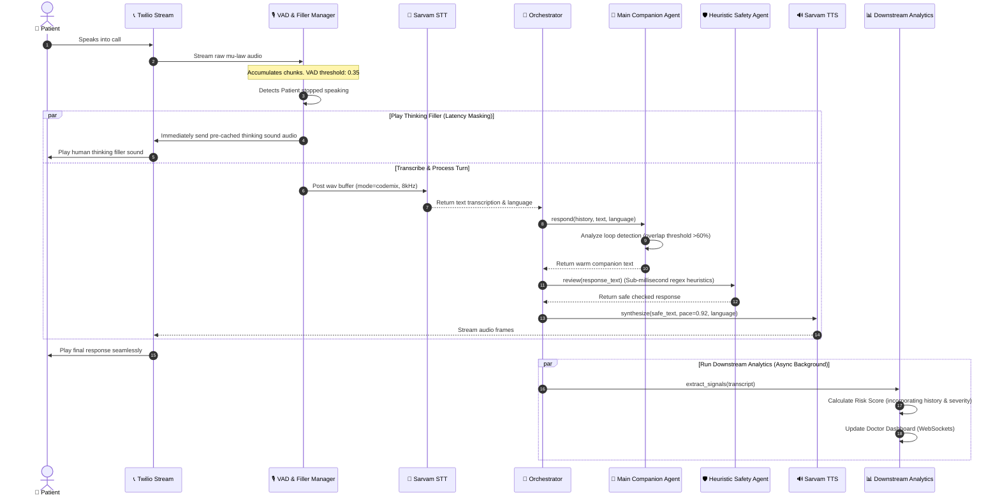
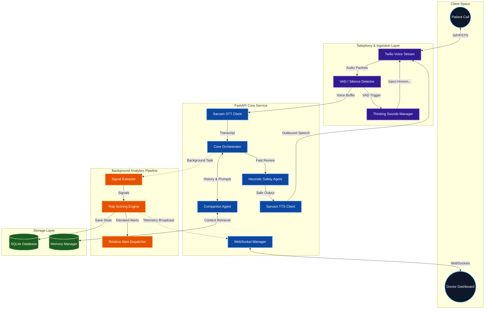

<div align="center">
  


# 🩺 Sahayi

<a href="https://git.io/typing-svg"></a>

**By Team Black Cats 🐈‍⬛**

<p align="center">
  
  
  
  
  
</p>

</div>

---

## 🟢 Live System Status & Telemetry

<div align="center">

| Core Service | Status | Latency (P50) | Region |
| :--- | :--- | :--- | :--- |
| 🎙️ **Voice Stream Gateway** |  **Operational** | ~12ms | India South |
| 🧠 **Indic LLM Orchestration** |  **Operational** | ~140ms | India South |
| 🛡️ **Heuristic Safety Pipeline** |  **Operational** | < 1ms | Edge |

</div>

Here is a live simulation of the Sahayi voice stream orchestrator. Notice the real-time VAD detection spikes and telemetry wave representing low-latency signal extraction:

<div align="center">
  
</div>

---

## 🌟 Overview

**Sahayi** is an AI-powered, phone-based companion designed specifically to check in on elderly and rural patients managing their health at home. Instead of relying on complicated apps or sterile robotic interfaces, Sahayi speaks to patients via regular phone calls with the warmth, empathy, and conversational fluency of a caring neighbor.

By leveraging advanced Speech-to-Text (STT) and Text-to-Speech (TTS) optimized for Indic languages (like Malayalam and Hindi), combined with a low-latency, heuristic safety pipeline, Sahayi feels entirely human. 

---

## ❗ Problem Statement

Elderly patients, particularly in rural areas, often struggle with modern healthcare technology. Apps are too complex, and traditional "IVR" phone systems are frustrating, slow, and distinctly robotic. When patients live far from clinics, minor symptoms can escalate unnoticed because regular check-ins are logistically impossible for overwhelmed healthcare workers.

Most existing AI voice bots suffer from high latency, unnatural "AI-like" phrasing, and the inability to understand code-mixed speech (e.g., mixing English words into Malayalam). This leads to poor patient engagement and critical health signals being missed.

---

## 💡 Solution

**Sahayi** flips the script by turning the AI into a warm companion. 

It proactively calls patients, uses human-like filler words ("ഹ്മ്മ്...", "I see...") instantly to mask processing latency, and mirrors the patient's emotional state. 

Behind the friendly voice, a sophisticated orchestration engine extracts health signals (e.g., sleep quality, diet, pain), assesses risk using localized medical heuristics, and escalates red-flag symptoms directly to a doctor or emergency contact.

---

## ✨ Core Features

### 🗣️ Ultra-Low Latency Conversational Voice
- **Instant Human Fillers**: Uses VAD (Voice Activity Detection) to immediately trigger pre-synthesized thinking sounds while the LLM generates the real response.
- **Code-Mixed Understanding**: Powered by Sarvam AI in `codemix` mode to perfectly understand patients who mix regional languages with English.
- **Anti-Looping Engine**: Actively monitors conversational patterns to change the topic if the patient gets stuck in a loop, preventing robotic repetition.

### 🧠 Empathetic Intelligence
- **Emotion Mirroring**: Adjusts tone and pacing based on the patient's current state.
- **Contextual Memory**: Remembers up to 15 key notes from past conversations to build a continuous, familiar relationship over time.

### 🏥 Clinical Safety & Routing
- **Risk Assessment Pipeline**: Runs silently in the background of the call, computing risk scores based on the patient's medical history and current signals.
- **Red-Flag Escalation**: Instantly detects severe symptoms (e.g., chest pain) and seamlessly bridges the patient directly to their doctor or an emergency responder.
- **Doctor Dashboard**: Provides doctors with a real-time WebSocket dashboard showing patient status, historical risk graphs, and summarized transcripts.

---

## 🏗️ Detailed Pipeline & System Architecture

### 1. Real-Time Voice Turn Processing Pipeline (Sequence Diagram)
Below is the highly detailed sequence of events mapping how audio streams, VAD triggers, prompt logic, and safety filters run concurrently to reduce perceived AI delay:



---

### 2. Functional System Diagram
This diagram shows how FastAPI services, WebSockets, background tasks, and AI engines communicate securely:



---

## 🛠️ Technology Stack

| Layer | Technology | Description |
|---|---|---|
| **Frontend** | Vite, React, TailwindCSS | Real-time doctor dashboard with dynamic risk plotting. |
| **Backend** | FastAPI, Python 3 | Async orchestration, WebSocket handling, and background task management. |
| **Telephony** | Twilio | Real-time media streams and WhatsApp integration. |
| **Voice AI (STT/TTS)** | Sarvam AI | Specialized Indic language speech models optimized for telephony. |
| **Intelligence** | LangChain, Gemini, OpenAI | LLM orchestration for persona maintenance, extraction, and safety. |
| **Database** | SQLite, SQLAlchemy | Relational storage for patient records, signals, and session history. |

---

## 📂 Project Structure

```text
Sahayi-HackX/
├── sahayi/
│   ├── backend/
│   │   ├── agents/           # LLM logic (Companion, Safety, Risk, WhatsApp)
│   │   ├── api/              # FastAPI routes and WebSocket handlers
│   │   ├── core/             # Application config and LLM clients
│   │   ├── db/               # SQLAlchemy models and SQLite database
│   │   ├── intelligence/     # Business logic, memory management, scoring
│   │   ├── voice/            # Twilio media stream handler, VAD, STT, TTS
│   │   └── main.py           # Application entrypoint
│   └── frontend/             # React Vite web application
├── sahayi_flow.svg           # Telemetry Wave SVG (Github Animation)
├── sahayi_banner.jpg         # Majestic header banner image
├── AGENTS.md                 # Agent behavior guidelines
└── README.md                 # You are here!
```

---

## ⚙️ Setup & Installation

### 1. Prerequisites
Ensure you have Python 3.10+ and Node.js installed.

### 2. Clone the Repository
```bash
git clone https://github.com/ChristopherJoshy/Sahayi-HackX-BlackCats.git
cd Sahayi-HackX/sahayi
```

### 3. Backend Setup
```bash
cd backend
python -m venv .venv
# Activate virtual environment (Windows)
.\.venv\Scripts\activate
# Install dependencies
pip install -r requirements.txt
```

### 4. Environment Variables
Copy `.env.example` to `.env` in the `backend` directory and add your keys:
```env
TWILIO_ACCOUNT_SID=your_sid
TWILIO_AUTH_TOKEN=your_token
SARVAM_API_KEY=your_sarvam_key
GEMINI_API_KEY=your_gemini_key
```

### 5. Run the Servers
**Backend:**
```bash
uvicorn main:app --reload --host 0.0.0.0 --port 8000
```
*(Optionally run `python seed.py` to populate test patients).*

**Frontend:**
```bash
cd ../frontend
npm install
npm run dev
```

---

<div align="center">
  <p>Built with ❤️ by Team Black Cats for HackX</p>
</div>
